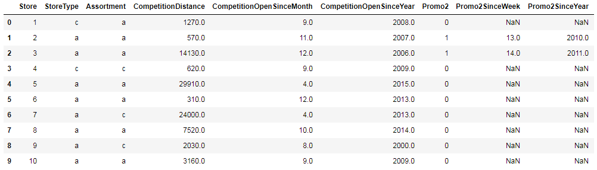
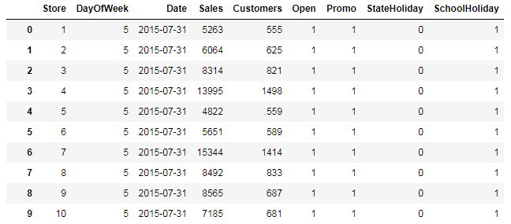

# 机器学习纳米学位
## 毕业项目开题报告
Seven He  
2018年8月7日

### 项目背景

------

德国最大的日化用品超市Rossmann在七个欧洲国家开设了超过3000家分店。Rossmann的管理层希望你能帮助预测1115家店铺未来6周的日销量。销量会受到许多因素的影响，包括促销、竞争对手、学校和法定节假日、季节性特征以及地理位置等等。可靠的销量预测能够协助店长创建有效的员工时间表，从而提高生产力和动力。通过帮助Rossmann创建一个强大的预测模型，您将帮助商店经理专注于最重要的事情：他们的客户和他们的团队！[[来自kaggle]](https://www.kaggle.com/c/rossmann-store-sales)

Rossmann未来销量预测，该问题实际上属于基于时间序列预测的范畴，这个领域已经有较为成熟的理论基础和算法模型，比如[ARIMA](https://en.wikipedia.org/wiki/Autoregressive_integrated_moving_average)和facebook开源的[Prophet](https://facebook.github.io/prophet/docs/quick_start.html)，也可以使用[XGBoost](https://en.wikipedia.org/wiki/Xgboost)等集成模型来预测。通过对未来销量的预测，能够协助企业制定促销计划、评估规模和成本、提高运营效率，最终提升行业竞争力和创造更多的利润空间。

我选择这个研究课题的主要原因是，在机器学习的众多领域中，我对数据挖掘这块最感兴趣，也跟我未来想从事的工作方向相契合。相信通过这个毕业项目，会提升数据挖掘相关的技能。另外，相较于CV、NLP、RL方向，数据集更小，模型复杂度更低，训练速度更快，更适合我算力不足的硬件环境。

### 问题描述

------

根据Rossmann提供的1115个分店的店铺信息，及31个月的销量相关数据，预测出其中856家商店未来6周的日销量。这是一个基于时间序列的预测问题，我们可以使用该领域的一些成熟模型，如[ARIMA](https://en.wikipedia.org/wiki/Autoregressive_integrated_moving_average)和[Prophet](https://facebook.github.io/prophet/docs/quick_start.html)，也可使用[XGBoost](https://en.wikipedia.org/wiki/Xgboost)等集成模型来做回归预测。

由于最终预测结果的是特定商店在特定日期的销售量，因此该回归问题是可以被量化的。Rossmann在Kaggle中提供了测试集，我们可以将预测结果与测试集做[RMSPE](https://www.rdocumentation.org/packages/MLmetrics/versions/1.1.1/topics/RMSPE)误差分析，即可衡量预测结果的优劣。若需要完全重现预测结果，保留随机数种子即可。

### 数据或输入

------

本项目主要用到两个数据集store.csv和train.csv，可以从在[Kaggle](https://www.kaggle.com/c/rossmann-store-sales/data)中获取。

store.csv提供商店相关的信息，包括商店类型、竞争对手相关信息、促销相关信息等，这些特征都与销量预测相关。其中某些特征存在缺失，实例如下图所示：

train.csv是时间序列相关的数据集，提供了特定商店在特定日期的销量信息及其他时间相关特征，如星期信息、节假日信息、促销信息、是否营业等，这些特征都与销量预测相关。其中某些特征存在缺失，且销量存在为0的情况。实例如下图所示：

首先我们需要对上述两个数据集进行更为详细的数据探索和可视化分析（EDA） ，以期加深对数据集和特征的理解，挖掘数据中潜在的规律，并分析归纳出一些结论。然后我们需要对数据集进行数据清洗，如对缺失值的处理，对离群值的处理。然后merge这两个数据集，基于时间进行分割测试集和验证集，并进行预测。

### 评估标准

------

根据[Kaggle](https://www.kaggle.com/c/rossmann-store-sales#evaluation)上的建议，我们使用[RMSPE](https://www.rdocumentation.org/packages/MLmetrics/versions/1.1.1/topics/RMSPE)作为评估标准。RMSPE即Root Mean Square Percentage Error，均方根百分比误差，具体数学公式为：

$\textrm{RMSPE} = \sqrt{\frac{1}{n} \sum_{i=1}^{n} \left(\frac{y_i - \hat{y}_i}{y_i}\right)^2}$

我们的目标是评估预测未来销量的准确程度，也就是要衡量预测值与真实值的接近程度。这是一个回归问题，比较常用的回归评价指标有RMSE，而RMSPE则是在RMSE的基础上，使用二者差值百分比而非二者差值。使用percentage error的好处是，由于销量的方差可能会很大，使用百分比误差标准化后会减小这部分影响。因此RMSPE对于量化评估基准模型和解决方案都是更为适合的。RMSPE值越小，则预测结果越准确。

### 基准模型

------

在这个项目中，我选择某些与销量相关性较高的特征的中位数作为基准模型。通过相关性分析（详见正式报告）可以发现，特定商店（Store）、星期信息（DayOfWeek）、促销信息（Promo）与最终销量的相关性较高，我们可以简单地使用这三个特征groupby之后的中位数作为预测销量。其中需要注意的是，对于训练集中的销量0值，我们需要提前去除，以免影响到中位数的计算。

基准模型的衡量方法与解决方案一致，使用上述的RMSPE评估标准，然后对比基准模型与解决方案的RMSPE值，值越小，则预测结果越准确。

### 项目设计

------

关于本项目的实施流程，我计划分为以下步骤：

首先进行较为详细的数据探索和可视化分析（EDA），以期加深对数据集和特征的理解，挖掘数据中潜在的规律，并分析归纳出一些结论。初步预计的数据分析包括：

- 全局探索性分析：对store，train两个数据集和test测试集进行全局探索性分析，如统计信息，每个特征的取值范围及分布，销量为0的数据，哪些特征有NaN缺失，探索特征间相关性等；
- 特征相关性分析：使用Seaborn的热力图，可视化特征间的相关性，尤其是销量与特征的相关性，有助于发现对销量影响最大的特征，也可以协助后续降维；
- 销量，顾客数与人均销量分析：除了预测值本身，我们还可以借助顾客数及人均销量（二者相除），进行各个维度的可视化分析；
- 基于时间序列的分析：选择某些样本，或者按照某种类别，进行基于时间序列的分析。需要对不同时间频率下进行分析，如每日，每周，每月，每季度等。这里需要考虑季节性和节假日；
- 商店Type和Assortment分析：针对不同商店不同的类型和类别进行可视化分析；
- 促销相关分析：分别分析两种促销策略对销量的影响；

在特征分析的同时，也需要对数据清洗和预处理，包括：

- 缺失值处理：某些特征值有数据缺失，根据当前特征的特点采取不同的处理方式：如填充均值、填充0值、填充推测值、甚至直接删除；
- 离散点和异常值处理：寻找数据集中的离散点和异常值并删除，如销量为0的数据，因为某些机器学习算法对噪声比较敏感；
- 表合并：merge store和train两张表；
- 特征编码：对于字符型和时间型特征进行编码，字符型特征可使用one-hot编码，时间特征进行特征拆分；
- 添加工程特征：通过可视化分析，对已有特征进行变换，或者添加新的特征，如day of month；
- 数据缩放：使用数据缩放，起到标准化的作用，如log transform Sales；

然后，我们可以开始设计和训练模型：

- 模型方面：我准备选择集成模型[XGBoost](https://en.wikipedia.org/wiki/Xgboost)，这里可以考虑设计多个集成模型，再把集成模型的结果再次集成起来做预测。多个集成模型可以包括不同时间频率，不同特征倾向等，进一步减小过拟合；
- 训练集验证集划分：由于本项目是基于时间序列的回归预测，训练集和验证集的划分需按照时间来切分，我们可以把训练集最后六周作为验证集；
- 超参数调优：超参数调优方面，我准备使用调参神器[hyperopt](https://github.com/hyperopt/hyperopt)，相较于sklearn里的GridSearch和RandomizedSearch，更适用于连续空间调参和异步调参；
- 基准模型：我准备采用上述提到的，与销量相关性较高的特征group后的中位数作为基准模型；
- 衡量标准：采用均方根百分比误差RMSPE作为评估标准，在Kaggle上作线上评估；

最终对测试集进行预测，对预测结果进行可视化分析，如此迭代，直到预测结果达到预期。最后总结得出结论。